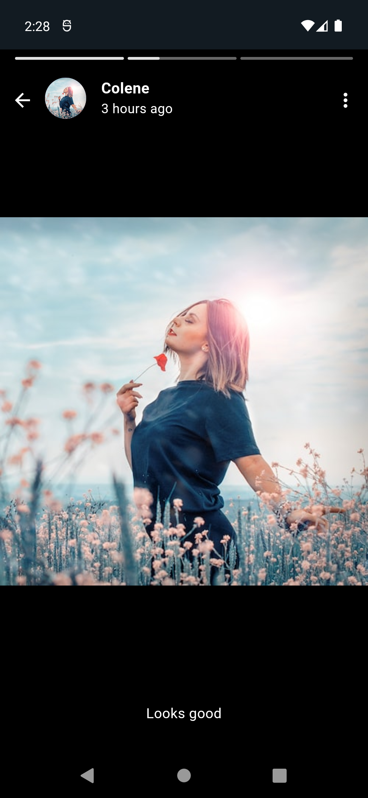

# WhatsApp Clone

### Setup & Installation

To get a local copy of the code, clone it using git:

```
git clone https://github.com/ridwanfbnr/whatsapp_clone_flutter
cd whatsapp_clone_flutter
flutter pub get
flutter run

Happy coding!
```

### Chats & Updates Screen Light

 
 

### Communities, Calls, Settings, Personal Chat Screen Light

 
 

### Chats & Updates Screen Dark

 
 

### Communities, Calls, Settings, Personal Chat Screen Dark

 
 

### Story View Screen

 

